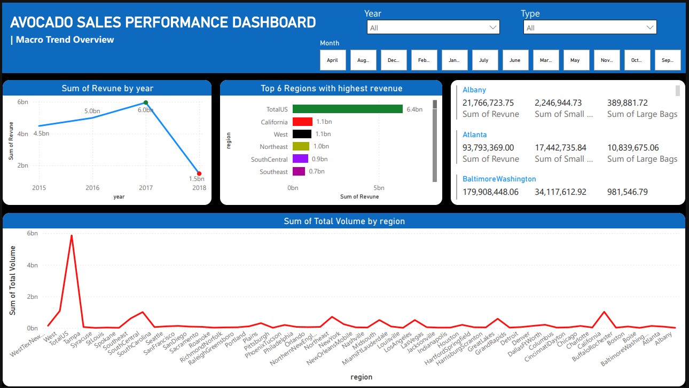
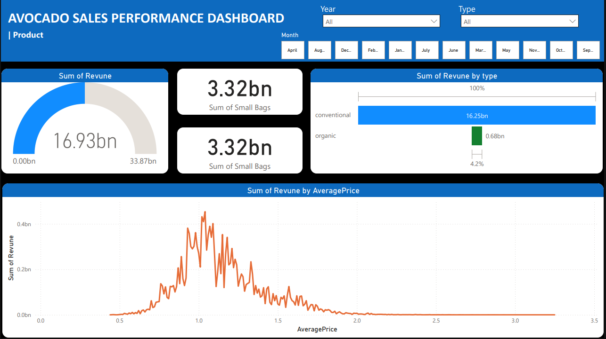

## Avocaddo Sales Performance Analysis Dashboard 

## Executive Summary
This report provides an in-depth analysis of avocado demand patterns, consumer behavior, and macro trends across regions in the United States. Using statistical insights and visualizations, it explores key factors influencing avocado consumption and highlights regional variations in demand.

## Macro Trend Overview (powerBI)

## Product Sales Overview (PowerBI)

## Task
This project is a part of Genration UK and Ireland intensive Bootcamp Program 

## The report addresses the following key questions:
Conventional vs. Organic Demand: Examining the disparity in demand between conventional and organic avocados, along with potential reasons for this difference.
Price Impact on Demand: Analyzing the relationship between average price and total volume to understand the price sensitivity of avocado consumers.
Macro Trends Over Time: Identifying regional trends in avocado sales and factors driving higher demand in specific areas, such as Tampa and the West region.
Regional Demand in 2018: Highlighting regions with the highest avocado demand, including the West, California, Northeast, South Central, Southeast, and Great Lakes.
This analysis provides actionable insights into consumer preferences, pricing dynamics, and regional factors that influence avocado sales, empowering stakeholders to refine their marketing strategies and distribution approaches.

## Tools Used
Excel :  for preliminary data exploration, cleaning the data, calculations and using piviot table to create interactive optional Dashboard.
Power BI Desktop: for creating dynamic and interactive visualizations to present the findings effectively.

## Data Sources 
Avocado Sales Data has provided by Generation UK & Ireland Data analytics Program.

## Key Findings
Conventional vs. Organic Demand: Examining the disparity in demand between conventional and organic avocados, along with potential reasons for this difference.
Price Impact on Demand: Analyzing the relationship between average price and total volume to understand the price sensitivity of avocado consumers.
Macro Trends Over Time: Identifying regional trends in avocado sales and factors driving higher demand in specific areas, such as Tampa and the West region.
Regional Demand in 2018: Highlighting regions with the highest avocado demand, including the West, California, Northeast, South Central, Southeast, and Great Lakes.
This analysis provides actionable insights into consumer preferences, pricing dynamics, and regional factors that influence avocado sales, empowering stakeholders to refine their marketing strategies and distribution approaches.

